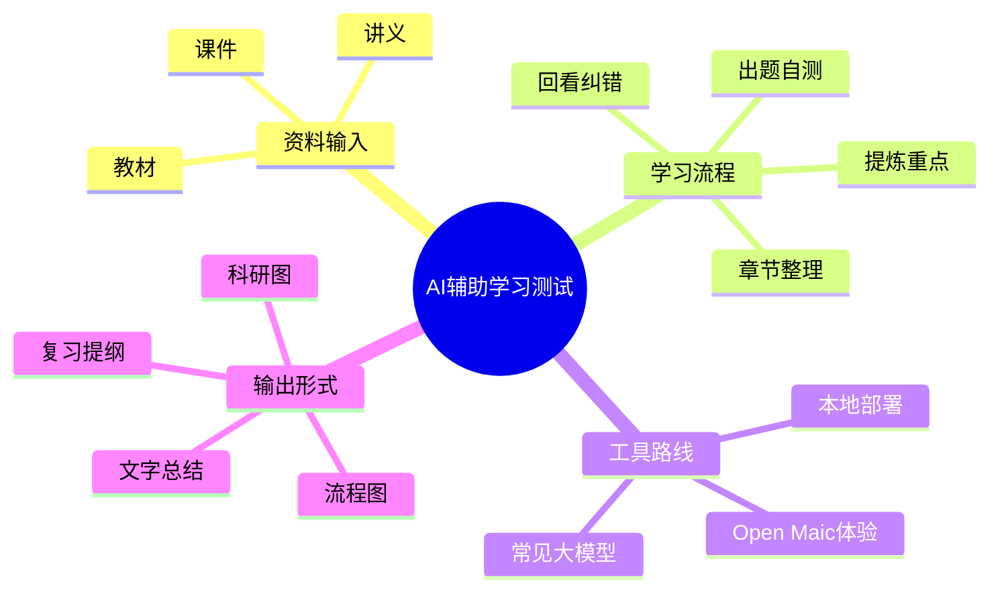

# 第五篇：编辑器兼容性验证（SVG 与 Mermaid 测试）

Brain，这一篇不是正式发布稿，只是给你做编辑器兼容性验证用的。

我这次先做两件事：

1. 放一个**标准的生物学科研流程 SVG**
2. 放一个**Mermaid 思维导图**

你的目标很简单：看看它们在你的编辑器里导入 Markdown 之后，能不能正常识别、显示，并在导出富文本后继续在其他平台正常渲染。

如果可以，我们后面就可以把 SVG / Mermaid 更系统地放进 1 到 4 篇文章里。
如果不可以，那后面就统一走另一条路线：

- 先保留结构化 SVG / Mermaid 源文件
- 再转成 PNG 或其他更稳的图片格式
- 最后把图片插入 1 到 4 篇正式文章

另外，我也去核了一下 OpenMAIC 项目原文。根据项目页可确认的几点，后面写正式稿时表述上要更严谨：

- 它确实是一个 **Open Multi-Agent Interactive Classroom** 项目
- 项目说明里明确写了 **built-in OpenClaw integration**
- 官方给了 **线上体验入口**
- 也提供了 **pnpm 本地启动、Vercel 部署、Docker compose** 等方式
- 如果长期用，本质上仍然会回到：**你自己的部署能力、服务器和 API 接入能力**

所以你前面提醒得对，正式稿里不能凭印象写，要尽量回到项目原文去核。

---

## 一、SVG 流程图测试

下面这张图是本次测试用的 SVG 文件，路径按你要求单独放在 `output/image/` 下面，命名规则也按“文章编号-图片编号-图片名称”来做。

**文件路径：**
`image/5-1-标准科学流程图.svg`

你可以先看编辑器是否能正确识别这个相对路径：

如果这张图在你的编辑器里能正常显示，并且导出富文本后仍然稳定，那后面 1 到 4 篇文章里的流程图、科研图骨架图就可以优先考虑保留 SVG。

如果这里已经显示不出来，或者导出后丢失，那后面我们就别赌，直接改成图片路线。

---

## 二、Mermaid 思维导图测试

下面这个 Mermaid 我先用一个非常标准、非常基础的思维导图结构来测试，不和前面正式文章直接绑定，只测试兼容性。

你现在主要看三件事：

1. 编辑器里 Mermaid 是否能直接渲染
2. 导出后的富文本里 Mermaid 是保留图形还是只剩代码块
3. 不同平台转发后是否还能正常显示

如果 Mermaid 在你的链路里不稳定，那后面我们就不要把它作为正式发布内容的直接载体，而是把 Mermaid 只当作内部结构草稿，再导成图片用。

---

## 三、这次测试你可以怎么判断

你可以直接按下面这个顺序测：

### 测试 1：在编辑器里导入 Markdown
- 看 SVG 是否直接显示
- 看 Mermaid 是否直接渲染

### 测试 2：导出富文本
- 看 SVG 是否还在
- 看 Mermaid 是否还是图，而不是退回代码块

### 测试 3：把导出的内容拿去别的平台试
- 微信公众号
- 知乎
- B 站专栏

重点不是编辑器里一时能不能看，而是**导出之后是否还能稳定带出去**。

---

## 四、如果测试失败，后面怎么处理

如果 SVG 或 Mermaid 任一项不稳定，我建议后面统一采用这套更稳的方式：

- **SVG / Mermaid 继续保留为源文件**，方便修改结构
- **正式文章里插入 PNG**
- 如果需要，我可以把每篇文章对应的结构图先画成标准 SVG
- 你再把你手上其他 AI 生成的美化图一起组合进去
- 最终发布稿只放图片，不直接赌平台对 SVG / Mermaid 的兼容性

这样最稳，也最符合你后面真正要发出去的要求。

---

## 五、这篇的用途

这篇你可以把它理解成一个技术验证页，不发布，只服务于后面 1 到 4 篇的图文工作流。

如果你测下来：

- **SVG 可用** → 后面我就按 SVG 结构图继续给你做
- **Mermaid 可用** → 后面某些脑图/流程图可以直接进文
- **都不可用** → 后面我就默认改成“先画结构源文件，再统一导图片”的路线

你先验证这一篇就行。等你给我结果，我再决定是直接把 SVG / Mermaid 植入前四篇，还是全部切成图片方案。
