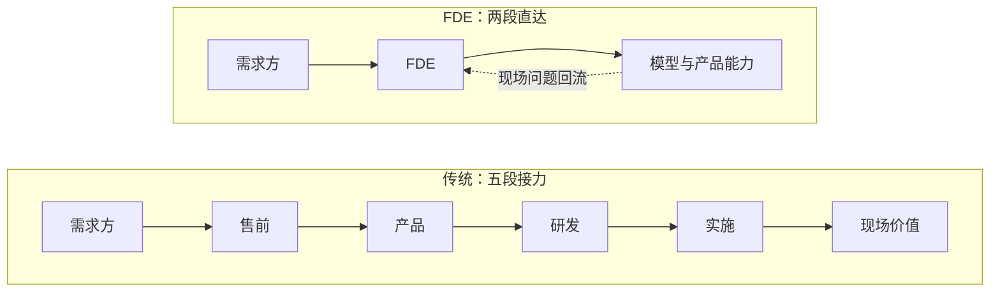

每个做过项目的人都见过同一个场面：老板或甲方说了一个模糊的目标，「我要一个能自动出报告的系统」，技术侧沉默三秒，回一句「这个做不了，或者排到下季度」。两边都没说错，但中间那道缝隙没人填。

过去，这道缝隙由一些名字模糊的岗位填着。现在，AI 公司给这道缝隙起了个新名字：**FDE**——Forward Deployed Engineer，前向部署工程师。

## FDE 是什么

这个词是 Palantir 带火的。它的传统是不把客户需求带回来，而是把工程师直接派到客户现场：带着产品住进去，现场改、现场交付。2025 年以来，OpenAI 和 Anthropic 的招聘列表里大量出现这个岗位，业务咨询公司反而开始焦虑。

一句话定义：人部署在客户现场，工具是前沿模型，交付的是能跑的系统。

它和传统研发的分工差异很清楚——研发对产品负责，FDE 对「这一家客户真的用起来了」负责。

## 这其实是个老职业

把镜头拉远，你会发现组织架构里一直有这类特殊角色：售前工程师、实施顾问、解决方案架构师、需求分析师、技术客户经理。名字五花八门，做的事高度同构：

- 把需求方的模糊语言翻译成技术方案
- 把技术侧的约束翻译成需求方能理解的代价
- 动手交付，而不是只出一份报告

这类角色很少被写进教科书，岗位说明书里永远说不清技术边界。组织把它当成本中心，做的人常被当成打杂——算是被遗忘的职业。

但注意，它们和 FDE 有一个根本差别。这个差别才是本文真正的主题。

## AI 时代为什么爆发

以前的翻译层，传话多于动手。售前画出方案，落地要靠后方研发排期；实施按文档部署，改一行代码都要走流程。客户现场产生的认知，回去走一个季度才能变成产品改进。

AI 把实现成本打到一个人可以端到端承接的程度。一个 FDE 带着模型 API 和一套工作流，几天之内就能把模糊目标变成客户正在使用的东西。交付物从 PPT 变成能跑的系统，反馈回路从季度缩短到天。

这才是 FDE 和售前的本质区别：不是换个名字，是反馈回路的长度变了。实现成本的坍缩，让「翻译」这个动作第一次可以和「交付」合并在同一个人身上。

## FDE 不是什么

- 不是销售工程师：不背签单指标，卖不出去的锅轮不到它背
- 不是外包：外包只完成现场任务，FDE 必须把现场认知回流给产品和模型团队
- 不是咨询：咨询交付报告和建议，FDE 自己写代码交付系统
- 不是客服：客服响应已发生的问题，FDE 预判流程里即将卡住的地方

| 维度 | FDE | 售前工程师 | 咨询顾问 | 后端研发 |
| --- | --- | --- | --- | --- |
| 交付物 | 能跑的系统 | 方案与演示 | 报告与建议 | 产品功能 |
| 离客户距离 | 驻场 | 投标期近 | 项目期近 | 远 |
| 动手写代码 | 重度 | 轻度演示 | 视项目而定 | 重度但面向产品 |
| 考核指标 | 客户用起来没有 | 签单 | 项目验收 | 迭代质量 |

## 和科研人的关系

如果你读过研，对 FDE 的工作方式应该觉得眼熟：导师提出一个模糊的想法，你把它翻译成实验设计和代码，交付结果，再把过程中的认知沉淀成方法。研究生本质上就是导师课题组的 FDE。

生信人的机会更具体。AI 制药和生物科技公司现在最缺的一种人，是既能看懂测序数据和生物学问题、又能把大模型能力部署进真实流程的人——去药企现场、去课题组现场、去医院现场。这个位置正好压在 FDE 的定义上。

需求方说不清问题这件事本身值得单独一谈，之前写过一篇：[你用不好 AI，是因为不会描述问题](/2026/08/24/2026-08-24-02-你用不好AI是因为不会描述问题/)。FDE 的日常，就是替客户把那个说不清的问题说清。

## 自测清单

适合的信号：

- 给你一个说不清的目标，你第一反应是拆问题，而不是等定义
- 你享受同时学业务和技术，两边都下得去手
- 客户今天改主意，你不崩溃，甚至预期之内
- 看到低效的工具链就手痒想重搭
- 你愿意为「真的用起来了」负最终责任

不适合的信号：

- 你需要清晰需求才能开工
- 你厌恶向不同的人重复解释同一件事
- 你希望成果长期沉淀、可复用，而不是散落在各个现场
- 你只想和代码打交道，不想和人打交道

## 为什么它不会消亡

有人担心 FDE 是一阵风：模型更强了、产品更自动化了，这个岗位会被吃掉。我的判断相反——短期根本不可能消亡，长期也绝不会失去价值。

把定义里的名词抽掉，剩下的骨架是「向导」：在需求方与能力之间那片不确定性地带里，带你过去的人。向导类的存在从来不会消失，它只是从一种形态换到另一种形态。高山向导没有因为等高线地图消失，领航员没有因为 GPS 消失，导游没有因为攻略消失，翻译没有因为机器翻译消失。工具每强一圈，向导交出去的是「认路」的体力部分，留下来的核心反而更值钱：判断该去哪、识别危险、在地图和真实地形对不上的时候拍板。

AI 时代同理。模型越强，需求方的想象力和表述能力并不会同步变强——「说不清要什么」是需求侧的永久属性；技术与真实业务地形对不上的缝隙，也是永久属性。缝隙在，向导就在。变化的只是站在那个位置的人手里的工具：从 PPT 和排期表，换成模型、Agent 和一套工作流。

## 结语

FDE 不是 AI 发明的新职业，它是被 AI 重新命名的老向导。

判断自己适不适合，不用看招聘要求里的技术栈清单，只看一件事：你是否享受问题永远定义不清的环境。享受，这就是你在 AI 时代最值钱的位置。
