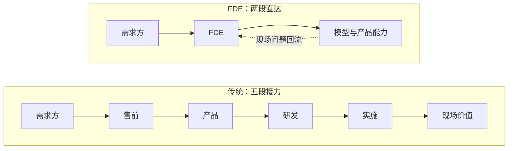

打开招聘软件，把两类页面放在一起看——这是笔者在今年的秋招里逐条翻出来的现实。

左边：生物技术专业，本科，昆明，秋招在招的岗位，6-9K。9K 要落在几家像样的公司身上，剩下的都在 6K 附近打转。

右边：FDE，Forward Deployed Engineer，前向部署工程师，12K 起，要求栏里往往只写「一年以上相关经验」；异地同岗普遍 20-25K，三年以上经验开到 30K 以上，学历清一色本科起步。同样的本科，同一个招聘软件，同一个时间窗口。

全国口径的二手数据支持同一个观感：麦可思就业蓝皮书里，2025 届本科毕业半年后的平均月收入是 6435 元，生物类常年贴着这条线走，职友集统计的生物技术实验员约 6.4K，2026 年比 2025 年涨 0.6%，约等于没涨；而 FDE 公开在招的样本里，腾讯云开到 35-65K×15 薪，猎聘北京同岗 20-45K×15 薪，还有一条「前沿部署工程师（医学背景）」开到 30-40K×18 薪。媒体统计这个岗位的招聘需求一年涨了 42 倍，国内岗位量一年翻了 7 倍。

很多生物专业的同学会默认这两个世界没有交集：左边是自己的命，右边是学计算机的人的命。这篇想讲清楚的是——交集不仅存在，而且比想象中大。但先把话说在前面：**结论不是劝你转行**。恰恰相反，理解了 FDE 为什么值钱，你会明白扔下专业去转码，才是真正吃亏的那条路。

## 市场长什么样：一轮真实的调查

先别急着下结论，把在招岗位摊开看。下面是我整理的样本（2026 年 9 月，Boss 直聘与猎聘公开数据）：

| 岗位 | 城市 | 薪资 | 备注 |
| --- | --- | --- | --- |
| 腾讯云 · AI 前线部署工程师 | 上海 | 35-65K × 15薪 | 大厂旗舰价 |
| 猎聘 · AI 前线部署工程师 | 北京 | 20-45K × 15薪 | 主流档 |
| 猎聘 · 高级 FDE 专家 | 北京 | 30-55K × 15薪 | 资深档 |
| 猎聘 · 前沿部署工程师 | 未注明 | 30-40K × 18薪 | 明确要医学背景 |
| 轻流 · AI 交付工程师 FDE | 上海 | 10-15K | 入门档 |
| 西麦科技 · 大模型应用开发（驻点） | 昆明 | 7-12K | 本地代表样本 |

三个规律值得注意。

**第一，学历门槛出乎意料地低，能力门槛出乎意料地高。** 绝大多数 FDE 岗只写「本科及以上」，经验从一年到十年不等——它不像算法岗那样卷学历，因为现场的问题没法用论文预答。北京某岗位甚至明确「计算机、人工智能相关专业硕士研究生及以上」，但那是对纯技术侧的要求；业务侧的 FDE 要的恰恰是行业方言。

**第二，晋升路径已经成型。** 典型的路线是 FDE → 高级 FDE / FDE 专家 → FDE Lead 或产品负责人。它不再是打杂岗的职业死胡同——头部公司已经把它建成了独立序列，岗位职责里白纸黑字写着「将一线经验沉淀为可复用的组件与方法论」，沉淀能力就是晋升依据。

**第三，医学背景是明码标价的加分项。** 那条 30-40K×18 薪的岗位直接写了医学背景优先——生物领域方言在 FDE 定价体系里是真实筹码，不是自我安慰。

## 溢价在为什么买单

同样本科，价格差出几倍，不是资本家偏心，是两边的定价逻辑不同。

生物实验岗的价格，被三股力量往下压：供给严重过剩，每年的毕业生远多于像样的岗位；技能在雇主眼里「不可迁移」，你会 PCR 会养细胞，换家实验室照样要重学流程；行业利润本身薄，下游服务卷成价格战。三个因素叠加，起薪贴着本科平均线就是市场出清价——跟你努不努力关系不大，数据也证明了这一点：0.6% 的年涨幅，连通胀都跑不赢。

AI 落地岗的溢价，也来自三股力量，只是方向全反过来：需求刚刚爆炸，每家公司都想「用起来」但不知道怎么用；能力稀缺，既听得懂业务方言又能动手交付的人极少；按结果定价，「用起来」直接对应收入或成本节省，雇主愿意为看得见的结果付溢价。

还有一条更隐蔽的定价规则：**学历在这个岗位里几乎不溢价，工程能力才是硬通货。** 同一个 FDE 岗，硕士进去不会比本科多拿——因为现场不考你论文，考你能不能三天内把一摊模糊需求变成在跑的系统。这对生物背景的人反而是好消息：你的学历牌面也许不占优，但工程能力是可以自己攒的，攒出来就计价。

想通这一层，就会看见一个反直觉的结论：AI 时代最不该做的就是和科班同学去卷入门级编程——那条路正在被模型自己堵上；最该做的是回到自己的领域，把 AI 叠加上去，成为那个「带着经验用 AI」的人。这也是本站反复出现的主题：杠杆要用在根基上。

## 一个 FDE 项目的第一周

空谈定价没意思，拿一个典型场景过一遍。某药企的 QC 部门想用大模型自动化批记录审核：每年几万页的生产批记录，人工逐项比对 SOP，慢、贵、还漏。

**第一天，不写代码。** 把 QC 主管的 SOP、历史批记录、最近三年的偏差报告读一遍，画出审核流程图：哪些是格式比对（签名齐不齐、日期对不对），哪些是语义判断（异常描述是否触发偏差流程）。这一天的产出是一张「判定点清单」，把一句「自动审核」翻译成 27 个可以逐个击破的具体问题。注意：这张清单只有懂 QC 的人画得出来，纯码农画不出来——这就是领域经验在定价体系里的位置。

**第二天，用历史数据做小实验。** 抽 50 份已经人工审核过的批记录让模型跑一遍，和人的结论对答案。格式比对接近全对，语义判断错一大半——模型总在「这算不算偏差」上犹豫。这一步把模糊的「用 AI 审核」压缩成一个精确的短板：判定标准没写成可执行的规则，人的判断长在 QC 主管脑子里。

**第三天，搭管线。** PDF 解析、字段抽取、规则比对、差异报告生成，串成流水线，部署进客户内网——数据一页不能出门，这是药企的红线。这一天真正花时间的不是模型调用，是权限申请、脱敏方案和内网部署。

**第四天，让验收人挑刺。** 把系统交给 QC 主管的团队随便投喂真实文档，专门收集「它错了」的时刻，每个错例追问到底：解析错了、规则错了，还是模型判断错了？挑刺记录直接变成验收标准。

**第五天，回流。** 演示、复盘，然后写内部文档：哪 20% 的定制是这家客户特有的，哪 80% 可以抽象成产品的通用能力（判定规则编辑器、批记录解析器）。FDE 和外包的分界线就在这份文档。

一周下来你会看到，FDE 的核心工作量根本不在「调模型」：第一天在翻译，第三天在工程，第四天在组织验收。模型 API 只是这条链上最便宜的一环。

## 这其实是个老职业

把镜头拉远，组织架构里一直有这类角色：售前工程师、实施顾问、解决方案架构师、需求分析师、技术客户经理。名字五花八门，做的事高度同构——把需求方的模糊语言翻译成技术方案，把技术侧的约束翻译成需求方能理解的代价，动手交付而不是只出报告。

值得深想一层的是：为什么这类角色总是「被遗忘」？不是没人看见他们干活，而是组织的度量衡照不到他们。研发的产出是代码仓库，销售的产出是合同额，而 FDE 类角色的产出是「一家客户真的用起来了」——这个东西进不了任何一条汇报线。于是预算把它记成成本中心，晋升体系里没有对口的职级。被遗忘不是事故，是度量衡的必然。

但这一轮不一样的地方在于：当岗位量一年涨 42 倍、大厂把它建成独立序列、晋升路径写进制度，「遗忘」正在被纠正。老职业等到了它的定价重估。

## AI 时代为什么爆发

以前的翻译层，传话多于动手。售前画出方案，落地要靠后方研发排期；实施按文档部署，改一行代码都要走流程。翻译和交付之所以分属两波人，唯一原因是「动手」太贵——贵到必须由一个研发团队按季度规划。

AI 把这个成本打穿了。实现成本坍缩之后，三个条件第一次同时成立：

1. **一个人可以端到端承接**：模型 API + Agent 工作流，几天内把模糊目标变成客户在用的东西
2. **接口标准化**：客户环境不再需要重写适配层，数据进出有成熟通道
3. **组织滞后**：需求方的流程、合规、习惯还没跟上，缝隙不但没关闭，反而变宽了

交付物从 PPT 变成能跑的系统，反馈回路从季度缩短到天：

这才是 FDE 和售前的本质区别：不是换个名字，是反馈回路的长度变了。「翻译」这个动作第一次可以和「交付」合并在同一个人身上。

## FDE 不是什么

- 不是销售工程师：不背签单指标，卖不出去的锅轮不到它背
- 不是外包：外包只完成现场任务，FDE 必须把现场认知回流给产品和模型团队
- 不是咨询：咨询交付报告和建议，FDE 自己写代码交付系统
- 不是客服：客服响应已发生的问题，FDE 预判流程里即将卡住的地方

| 维度 | FDE | 售前工程师 | 咨询顾问 | 后端研发 |
| --- | --- | --- | --- | --- |
| 交付物 | 能跑的系统 | 方案与演示 | 报告与建议 | 产品功能 |
| 离客户距离 | 驻场 | 投标期近 | 项目期近 | 远 |
| 动手写代码 | 重度 | 轻度演示 | 视项目而定 | 重度但面向产品 |
| 考核指标 | 客户用起来没有 | 签单 | 项目验收 | 迭代质量 |

## 这个模式的四种失效方式

FDE 不是万能解法，它的失败有清晰的路径。

**一，认知断流。** FDE 在现场学到的判断没有回流产品：产品团队不看驻场报告，规则库散落在个人笔记本里。可观察的信号是同一个定制在第二个客户那里又从零写了一遍。

**二，单点依赖。** 客户只认那个人，FDE 休假等于事故。这恰恰是向导价值的证明，但从组织角度它是风险：向导的价值长在人身上，人就不可替换。

**三，边界漂移。** 现场定制越写越多，FDE 团队悄悄维护起一个影子产品。信号很明确：FDE 的 repo 开始出现 release notes。

**四，合规红线。** 医疗、金融的数据不出域要求，会直接否掉「调用云端大模型」的默认方案，FDE 不得不在本地模型能力和业务需求之间重新谈判。红线不会消失，它只是把「能用什么工具」变成现场判断的一部分。

## 为什么它不会消亡

有人担心 FDE 是一阵风：模型更强了、产品更自动化了，这个岗位会被吃掉。我的判断相反——短期根本不可能消亡，长期也绝不会失去价值。

给一个截稿时点的注脚：就在十二天前，OpenAI 发布了 GPT-6（Astra），各项基准逼近满分，「一句话生成一个像样的东西」已经是任何人坐在电脑前就能做到的事。你看，单点能力的天花板又抬高了一截——然后呢？招聘平台上 FDE 的岗位和薪资不降反升。

因为「能生成」和「敢上线、能负责」之间隔着完整的向导工作：需求方说不清要什么——[你用不好 AI，是因为不会描述问题](/2026/08/24/2026-08-24-02-你用不好AI是因为不会描述问题/)，这是需求侧的永久属性；生成物与真实业务地形对不上，需要有人逐项验收、拍板、兜底。模型每强一圈，向导交出去的是「认路」的体力部分，留下来的核心反而更值钱：判断该去哪、识别危险、在地图和真实地形对不上的时候拍板。高山向导没有死于等高线地图，领航员没有死于 GPS，翻译没有死于机器翻译——同一个规律。之前写过 [AI 把稀缺性从代码翻到了别处](/2026/08/30/2026-08-30-01-从Show-me-the-code到Show-me-the-talk-AI把稀缺性翻了个面/)，说的就是这个过程。

缝隙在，向导就在。变化的只是站在那个位置的人手里的工具：从 PPT 和排期表，换成模型、Agent 和一套工作流。

## 生物人的正解：叠加，不是转型

回到开头那两张招聘页面。看到落差之后，多数人的第一反应是「我要去学编程、去做 AI」——停一下，这正是最容易被带偏的方向。

纯转码的账越来越不划算：AI 编程让入门级编程能力通胀，你花两年从零学到的 CRUD 功夫，正好是模型替代得最快的部分。**转型的成本在涨，叠加的溢价在涨**——该做的不是换赛道，是在生物的赛道上把 AI 叠上去。

三层叠加，一层都不少：

- **第一层，领域根基**：生物学的训练——看懂 SOP、读得懂批记录、知道实验哪里会翻车。这是纯码农永远补不上的部分，也是 FDE 第一天那张判定点清单的来源。市场上「医学背景优先」明码标价，就是这一层的直接证据
- **第二层，生信工程**：把领域问题翻译成可复现的管线。本站拆过的 [Bio-SDK 工具链](/2026/08/19/2026-08-19-05-拆Bio-SDK-一个不生成脚本的本地生信工具链是怎么搭的/)就属于这一层：schema 门禁、只读环境、计划先行——工程习惯比脚本数量值钱
- **第三层，AI 应用**：把模型能力接进真实流程。在招岗位的要求写得明明白白：Prompt 工程、RAG、Agent 框架——这些是可以自学自练的，从把一次真实的科研流程自动化做完开始，形成「用起来了」的案例

如果你读过研，这三层你其实都摸过：导师的模糊想法就是甲方说不清的目标，开题调研就是现场尽调，实验记录就是认知沉淀，论文就是交付物。研究生本质上就是导师课题组的 FDE，只是没人这么叫，也没人按这个标准算工资。

几句清醒剂：数据口径要分清——20-45K 是全国主流档，本地入门岗（比如昆明驻点的 7-12K）依然是市场现实，异地点薪和远程是拉平差距的通道而不是默认福利；别裸辞，先在现单位找一个真实场景把三层串一遍；英语文档和 API 是硬通货；最后，FDE 是高强度岗位，驻场、多变、背交付——向导不是好当的。

## 自测清单

适合的信号：

- 给你一个说不清的目标，你第一反应是拆问题，而不是等定义
- 你享受同时学业务和技术，两边都下得去手
- 客户今天改主意，你不崩溃，甚至预期之内
- 看到低效的工具链就手痒想重搭
- 你愿意为「真的用起来了」负最终责任

不适合的信号：

- 你需要清晰需求才能开工
- 你厌恶向不同的人重复解释同一件事
- 你希望成果长期沉淀、可复用，而不是散落在各个现场
- 你只想和代码打交道，不想和人打交道

## 数据口径

这篇文章有两类数据，口径不同，用法也不同。

一手观察：6-9K 与 12K 起、异地同岗 20-25K 普遍、30K+ 对应三年以上经验——来自笔者在 2026 年秋招期间逐条翻看正规招聘软件的实记，是当下的在招价，也是本文的锚。样本有限，但胜在新鲜、贴身。

二手统计：麦可思《中国本科生就业报告》（2025 届本科毕业半年后平均月收入 6435 元）、[职友集生物技术专业统计](https://edu.jobui.com/m/major/shengwujishu/)、[猎聘在招岗位](https://www.liepin.com/job/1985509823.shtml)与 Boss 直聘公开页（腾讯云 35-65K×15 薪等）、[36氪关于岗位增速的报道](https://m.36kr.com/p/3960032943504520)、[OpenAI 官网的 GPT-6 发布信息](https://openai.com/zh-Hans-CN/index/gpt-6-astra/)。统计网站给的是滞后的均值，媒体给的是放大的倍数——它们负责勾勒轮廓，秋招在招价才是成交现实。

## 结语

FDE 不是 AI 发明的新职业，它是被 AI 重新命名的老向导。那份溢价的本质，市场已经写得清清楚楚——买的不是代码，是「领域经验 × AI 应用」的交集，而这个交集，本来就是生物人手里应该有的牌。

判断自己适不适合，不用看招聘要求里的技术栈清单，只看一件事：你是否享受问题永远定义不清的环境。享受，这就是你在 AI 时代最值钱的位置。
