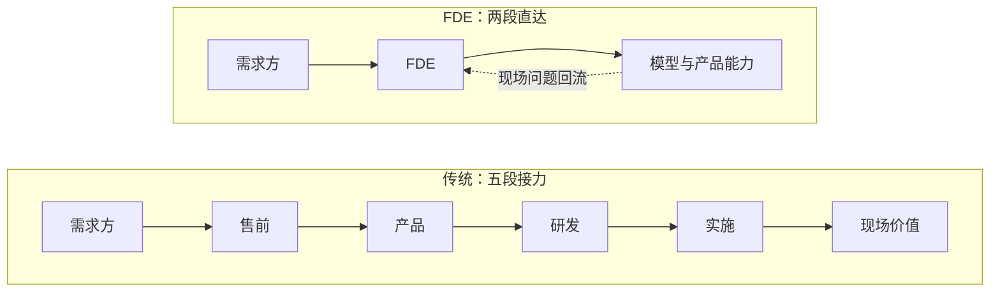

每个做过项目的人都见过同一个场面：老板或甲方说了一个模糊的目标，「我要一个能自动出报告的系统」，技术侧沉默三秒，回一句「这个做不了，或者排到下季度」。两边都没说错，但中间那道缝隙没人填。

过去，这道缝隙由一些名字模糊的岗位填着。现在，AI 公司给这道缝隙起了个新名字：**FDE**——Forward Deployed Engineer，前向部署工程师。

## FDE 是什么

这个词是 Palantir 带火的。它的一条组织铁律是：不把客户需求带回来，把工程师派过去。FDE 带着产品住进客户环境，现场改、现场交付，一驻就是几个月。Palantir 的产品哲学里有一个说法叫 edge case first——最边角的、最真实的现场问题不是麻烦，而是产品的起点；FDE 把现场的工作流一条条吃进产品，行业认知就是这么长在产品里的。

2025 年以来，OpenAI 和 Anthropic 的招聘列表里大量出现这个岗位。扒开职位描述，措辞高度一致：直接进驻客户、在客户的代码库和数据上做出能用的东西、把可复用的部分抽象回来喂给产品。翻译成人话：**人部署在客户现场，工具是前沿模型，交付的是能跑的系统。**

它和传统研发的分工差异很清楚——研发对产品负责，FDE 对「这一家客户真的用起来了」负责。

## 一个 FDE 项目的第一周

空谈定义没意思，拿一个典型场景过一遍。某药企的 QC 部门想用大模型自动化批记录审核：每年几万页的生产批记录，人工逐项比对 SOP，慢、贵、还漏。这是最典型的 FDE 项目——需求方说得清痛点，说不清方案。

**第一天，不写代码。** 把 QC 主管的 SOP、历史批记录、最近三年的偏差报告读一遍，画出审核流程图：哪些是格式比对（签名齐不齐、日期对不对），哪些是语义判断（异常描述是否触发偏差流程）。这一天最重要的产出是一张「判定点清单」——它把一句「自动审核」翻译成了 27 个可以逐个击破的具体问题。

**第二天，用历史数据做小实验。** 抽 50 份已经人工审核过的批记录，让模型跑一遍，和人的结论对答案。结果符合预期：格式比对接近全对，语义判断错一大半——模型总在「这算不算偏差」上犹豫。这一步的价值不是跑通，是把模糊的「用 AI 审核」压缩成一个精确的短板：**判定标准本身没有写成可执行的规则**，人的判断长在 QC 主管脑子里。

**第三天，搭管线。** PDF 解析、字段抽取、规则比对、差异报告生成，串成一条流水线，部署进客户内网——数据一页都不能出门，这是药企的红线。这一天真正花时间的不是模型调用，是权限申请、脱敏方案和内网部署。

**第四天，让验收人挑刺。** 把系统交给 QC 主管，让团队成员随便投喂真实文档，专门收集「它错了」的时刻。每一个错例都被追问：是解析错了、规则错了，还是模型判断错了？挑刺记录直接变成验收标准——FDE 项目最忌讳验收方在上线那天才第一次认真看系统。

**第五天，回流。** 演示、复盘，然后写一份内部文档：哪 20% 的定制是这家客户特有的，哪 80% 可以抽象成产品里的通用能力（判定规则编辑器、批记录解析器）。FDE 和外包的分界线就在这份文档——现场认知必须回到产品，否则下一次接同行业客户，前面的坑再踩一遍。

一周下来你会看到，FDE 的核心工作量根本不在「调模型」：第一天在翻译，第三天在工程，第四天在组织验收。模型 API 只是这条链上最便宜的一环。

## 这其实是个老职业

把镜头拉远，组织架构里一直有这类角色：售前工程师、实施顾问、解决方案架构师、需求分析师、技术客户经理。名字五花八门，做的事高度同构——把需求方的模糊语言翻译成技术方案，把技术侧的约束翻译成需求方能理解的代价，动手交付而不是只出报告。

值得深想一层的是：**为什么这类角色总是「被遗忘」？**

不是没人看见他们干活，而是组织的度量衡照不到他们。研发的产出是代码仓库，销售的产出是合同额，咨询的产出是报告——FDE 类角色的产出是「一家客户真的用起来了」，这个东西没法进任何一条汇报线。于是预算把它记成成本中心，晋升体系里它没有对口的职级，岗位说明书永远写不清技术边界。做的人自嘲是打杂，走的人被研发和销售同时挖。被遗忘不是事故，是度量衡的必然。

## AI 时代为什么爆发

以前的翻译层，传话多于动手。售前画出方案，落地要靠后方研发排期；实施按文档部署，改一行代码都要走流程。客户现场产生的认知，回去走一个季度才能变成产品改进。翻译和交付之所以分属两波人，唯一的原因是「动手」太贵——贵到必须由一个研发团队按季度规划。

AI 把这个成本打穿了。实现成本坍缩之后，三个条件第一次同时成立：

1. **一个人可以端到端承接**：模型 API + Agent 工作流，几天内把模糊目标变成客户在用的东西
2. **接口标准化**：客户环境不再需要为对接重写适配层，数据进出有成熟通道
3. **组织滞后**：需求方的流程、合规、习惯还没跟上，缝隙不但没有关闭，反而变宽了

交付物从 PPT 变成能跑的系统，反馈回路从季度缩短到天：

这才是 FDE 和售前的本质区别：不是换个名字，是反馈回路的长度变了。「翻译」这个动作第一次可以和「交付」合并在同一个人身上。

## FDE 不是什么

- 不是销售工程师：不背签单指标，卖不出去的锅轮不到它背
- 不是外包：外包只完成现场任务，FDE 必须把现场认知回流给产品和模型团队
- 不是咨询：咨询交付报告和建议，FDE 自己写代码交付系统
- 不是客服：客服响应已发生的问题，FDE 预判流程里即将卡住的地方

| 维度 | FDE | 售前工程师 | 咨询顾问 | 后端研发 |
| --- | --- | --- | --- | --- |
| 交付物 | 能跑的系统 | 方案与演示 | 报告与建议 | 产品功能 |
| 离客户距离 | 驻场 | 投标期近 | 项目期近 | 远 |
| 动手写代码 | 重度 | 轻度演示 | 视项目而定 | 重度但面向产品 |
| 考核指标 | 客户用起来没有 | 签单 | 项目验收 | 迭代质量 |

## 这个模式的四种失效方式

FDE 不是万能解法，它的失败有清晰的路径。看清失效方式，比听成功故事有用。

**一，认知断流。** FDE 在现场学到的判断没有回流产品：产品团队不看驻场报告，FDE 的规则库散落在个人笔记本里。可观察的信号是同一个定制在第二个客户那里又从零写了一遍。解法在组织不在个人——回流必须有硬性载体（组件提案、发版计划），不能靠自觉。

**二，单点依赖。** 客户只认那个人，系统出问题只给 FDE 发消息，FDE 休假等于事故。这恰恰是向导价值的证明，但组织角度它是风险：向导的价值长在人身上，人就不可替换。成熟的 FDE 团队会刻意做交接轮换，代价是短期效率。

**三，边界漂移。** 现场定制越写越多，FDE 团队悄悄维护起一个影子产品——有自己的发版周期、自己的技术债，和主线产品越走越远。信号很明确：FDE 的 repo 开始出现 release notes。这时候该做的不是继续堆功能，是把影子产品里的通用部分收编回主线。

**四，合规红线。** 医疗、金融行业的数据不出域要求，会直接否掉「调用云端大模型」的默认方案。FDE 不得不在本地化部署的模型能力与业务需求之间重新谈判——哪些判断放给模型，哪些退回规则引擎。信号是客户开始要求审计日志和私有化部署。红线不会消失，它只是把「能用什么工具」变成 FDE 现场判断的一部分。

## 为什么它不会消亡

有人担心 FDE 是一阵风：模型更强了、产品更自动化了，这个岗位会被吃掉。我的判断相反——短期根本不可能消亡，长期也绝不会失去价值。这不是信仰，是一个可以检验的命题。

把定义里的名词抽掉，剩下的骨架是「向导」：在需求方与能力之间那片不确定性地带里，带你过去的人。向导要彻底消失，需要两个条件同时成立：**地形完全确定**（地图与真实地形再无出入），并且**需求方能独立完成表述与决策**（不需要任何人替他把模糊变成清晰）。

历史给过足量的样本。等高线地图和登山手册普及之后，高山向导没有消失——向导交出了「认路」，留下了路线决策与风险拍板；GPS 普及之后，领航员从驾驶舱消失了，但机组资源管理里的判断分工没有消失；机器翻译普及之后，翻译没有消失，它从「转述语句」上移到了「承担利害」——合同、谈判、本地化，机器翻得起，责任翻不起；攻略平台普及之后，导游转型成定制游和深度向导，卖的不再是信息，是判断和兜底。

规律是一致的：**工具每强一圈，消灭的是信息差里的体力部分，留下的是利害承担与判断。** 而判断和责任无法外包给工具——你没法让一个模型替你承担「批记录漏审」的 GMP 责任。

需求侧还有一个永久属性：说不清要什么。模型越强，需求方的想象力与表述能力并不会同步变强——[你用不好 AI，是因为不会描述问题](/2026/08/24/2026-08-24-02-你用不好AI是因为不会描述问题/)，这件事不随工具进步而消失，因为它是需求侧的属性而不是工具侧的属性。缝隙在，向导就在。变化的只是站在那个位置的人手里的工具：从 PPT 和排期表，换成模型、Agent 和一套工作流。

## 和科研人的关系

如果你读过研，对 FDE 的工作方式应该觉得眼熟。逐项对照：

| 科研训练 | FDE 工作 |
| --- | --- |
| 导师的模糊想法 | 甲方说不清的目标 |
| 开题调研 | 现场尽调与流程拆解 |
| 组会汇报 | 需求评审与进度对齐 |
| 实验记录 | 现场认知沉淀 |
| 论文与代码 | 能跑的交付物 |
| 审稿意见 | 验收方挑刺 |
| 方法可复现 | 定制回流产品化 |

研究生本质上就是导师课题组的 FDE，只是没人这么叫，也没人按这个标准给你算工资。

生信人的机会更具体。AI 制药和生物科技公司现在最缺的一种人，是既能看懂测序数据和生物学问题、又能把大模型能力部署进真实流程的人——去药企现场、去课题组现场、去医院现场。这个位置正好压在 FDE 的定义上。它的日常会非常「脏」：每家医院的 LIS 环境都不一样，每家药企的 SOP 都有自己的方言，而你的价值恰恰是把模型能力迁就进这些方言里。

## 自测清单

适合的信号：

- 给你一个说不清的目标，你第一反应是拆问题，而不是等定义
- 你享受同时学业务和技术，两边都下得去手
- 客户今天改主意，你不崩溃，甚至预期之内
- 看到低效的工具链就手痒想重搭
- 你愿意为「真的用起来了」负最终责任

不适合的信号：

- 你需要清晰需求才能开工
- 你厌恶向不同的人重复解释同一件事
- 你希望成果长期沉淀、可复用，而不是散落在各个现场
- 你只想和代码打交道，不想和人打交道

## 结语

FDE 不是 AI 发明的新职业，它是被 AI 重新命名的老向导。组织曾经用「遗忘」对待这个位置，AI 时代它第一次站到了舞台中央——因为实现成本坍缩之后，现场判断成了稀缺品。

判断自己适不适合，不用看招聘要求里的技术栈清单，只看一件事：你是否享受问题永远定义不清的环境。享受，这就是你在 AI 时代最值钱的位置。
